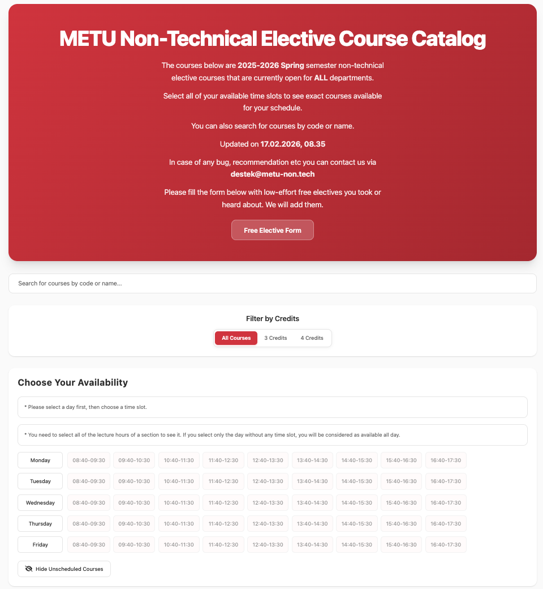
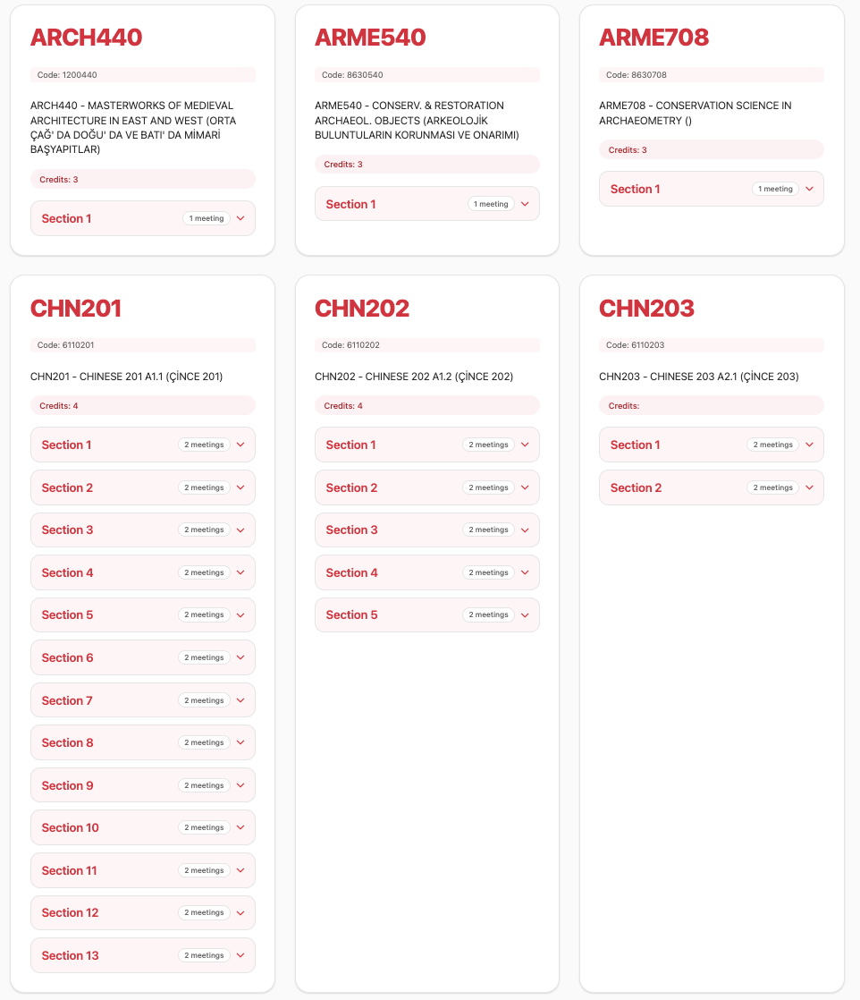

# METU Non-Technical Elective Catalog

A community-built course catalog that helps Middle East Technical University (METU) students discover **non-technical elective (NTE) courses** that fit their weekly schedule.

🌐 **Live at [metu-non.tech](https://metu-non.tech)**

> This is a volunteer, non-commercial project maintained by METU students for METU students. It is free to use, open source, and open to contributions.

<p align="center">
  
  <br />
  <em>Pick the days and hours you're free, and the catalog filters itself in real time.</em>
</p>

<p align="center">
  
  <br />
  <em>Every matching course is shown with its sections — some have one, some have a dozen.</em>
</p>

---

## What it does

Every semester, METU offers a long list of non-technical electives — courses open to students from every department. Finding the right one means cross-checking departmental announcements, opening the official course catalog, decoding section times, and praying nothing clashes with your existing classes.

This site does that work for you:

- 📚 **One place for all open NTE courses.** Only courses currently open to students from *all* departments are shown.
- 🕒 **Time-slot filter.** Pick the days and hours you're free, and the catalog instantly narrows down to the courses you can actually take.
- 🔍 **Search by code or name.** Find a course you've already heard about in one click.
- 🎚️ **Credit filter.** Quickly switch between 3-credit and 4-credit options.
- 👻 **Show / hide unscheduled sections.** Some sections don't have a published time yet — you can choose to keep them visible or hide them.
- 🌗 **Light & dark themes.**

The semester label and "last updated" timestamp at the top of the page tell you exactly how fresh the data is.

---

## How the data gets here

The data shown on this site is collected and updated by a sibling project, **[robotdegilim.xyz](https://robotdegilim.xyz)**, which scrapes the official METU course catalog on a schedule and uploads the processed results to public S3 endpoints. This frontend simply fetches those JSON files and renders them.

> Historically, the NTE-finding logic lived inside this repository as its own backend. To avoid maintaining two separate backends across the two projects, that logic was merged into the `robotdegilim.xyz` backend. This repo is now a pure frontend.

If you find a course that should appear here but doesn't, or vice versa, the issue is most likely in the data pipeline rather than in this repo — but feel free to open an issue here and we'll route it to the right place.

---

## Help us grow the list

If you've taken — or heard about — a low-effort free elective that isn't in the catalog yet, please fill out the form linked at the top of the site. We review submissions and add eligible courses manually.

---

## Running it locally

You'll need [Node.js](https://nodejs.org/) (v18 or newer recommended).

```bash
git clone https://github.com/hgunduzoglu/metunontech-front.git
cd metunontech-front
npm install
npm run dev
```

The dev server will start at `http://localhost:5173`.

Other useful scripts:

```bash
npm run build      # Production build into ./dist
npm run preview    # Preview the production build locally
```

The app talks to the public S3 endpoints out of the box — no environment variables or local backend required.

---

## Tech stack

- **React 19** + **TypeScript**
- **Vite** as the build tool
- Plain CSS (no UI framework) — see [`public/styles.css`](public/styles.css)
- Hosted on **Vercel** with `@vercel/analytics` and `@vercel/speed-insights`

---

## Contributing

Contributions are very welcome — whether you're fixing a typo, adding a feature, or improving the design. This project is run by volunteers, so any help goes a long way.

### Reporting a bug or suggesting a feature

1. Check the [existing issues](https://github.com/hgunduzoglu/metunontech-front/issues) first.
2. If your issue isn't already listed, open a new one. Please include:
   - What you saw vs. what you expected
   - Steps to reproduce (if it's a bug)
   - Browser / OS if it looks like a rendering issue

You can also reach us at **destek@metu-non.tech**.

### Submitting a pull request

1. Fork the repository and create a branch:
   ```bash
   git checkout -b your-feature-name
   ```
2. Make your changes. Try to keep the scope focused — one fix or one feature per PR.
3. Make sure the project still builds:
   ```bash
   npm run build
   ```
4. Push your branch and open a pull request against `main`. Briefly describe what you changed and why.

### Good first contributions

- Improving accessibility (keyboard navigation, ARIA labels, color contrast)
- Adding tests
- UI polish, especially on mobile
- Translating the interface (currently English-only)
- Documentation improvements

If you're planning something bigger (a new major feature, a redesign, etc.), please open an issue first so we can sync on direction before you invest a lot of time.

---

## Contact

- ✉️ **destek@metu-non.tech**
- 🐛 [GitHub issues](https://github.com/hgunduzoglu/metunontech-front/issues)

---

## License

This project is released under the [MIT License](LICENSE). You're free to use, modify, and redistribute it — attribution is appreciated.
